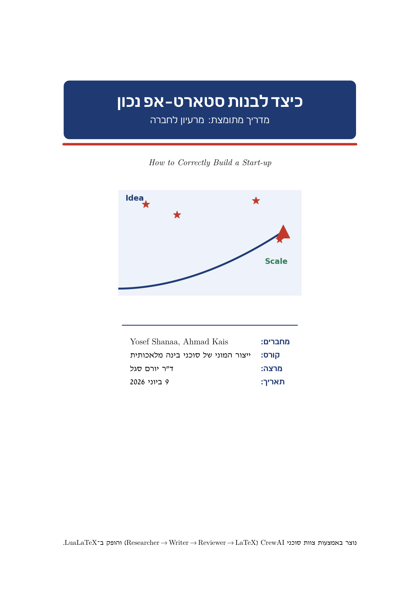
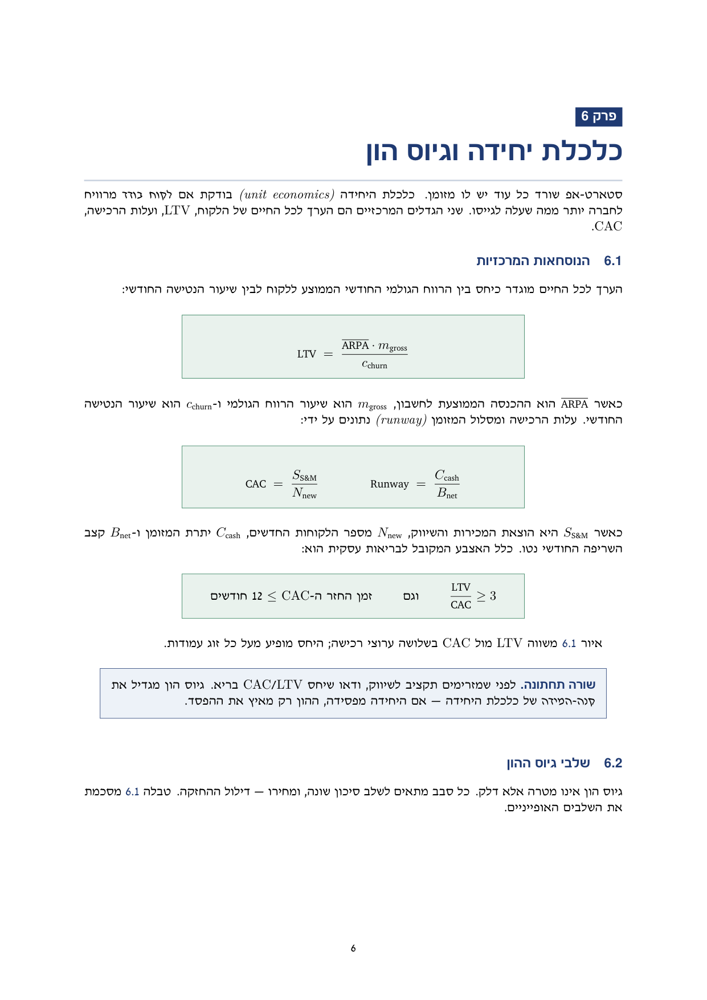
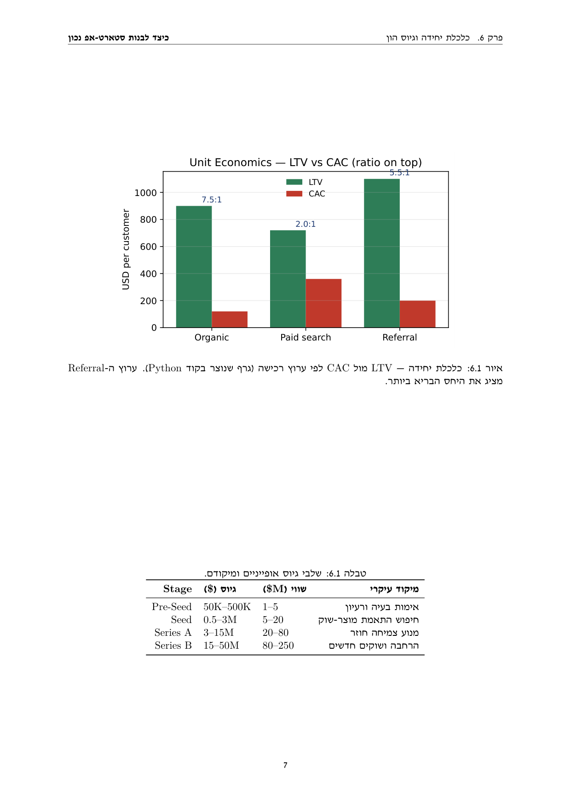
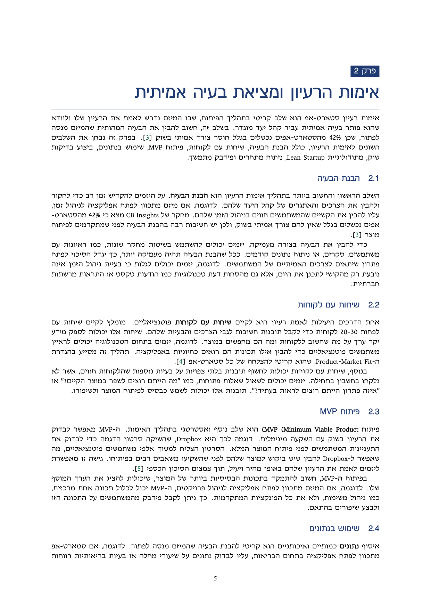

# Startup Mini-Book Generator · CrewAI → LaTeX

[](https://github.com/yosefshanaa/HW3/actions/workflows/ci.yml)
[](https://www.python.org/)
[](LICENSE)
[](#quality--ci)
[](#quality--ci)

A production-style, agent-based content factory: it turns a single topic string
into a finished, professionally typeset **bilingual (Hebrew/English) mini-book** —
*“How to Correctly Build a Start-up”* (כיצד לבנות סטארט-אפ נכון). A **CrewAI**
team (Researcher → Writer → Reviewer → LaTeX Engineer) drafts the prose; a
**LuaLaTeX** layer typesets it with correct right-to-left Hebrew and left-to-right
English, code, and math.

> **Course:** *Mass Production of AI Agents* — Dr. Yoram Segal · Assignment 03 (§13).
> **Authors:** Yosef Shanaa · Ahmad Kais (group `ahk-yosi`).
> **Thesis it demonstrates:** *“a production agent is a system, not a prompt.”*

<p align="center">
  
  
  
</p>
<p align="center"><sub>book.pdf — cover · boxed math formulas in BiDi prose · a Python-made chart + a table</sub></p>

---

## Two books, one pipeline (read this first)

The repository ships **two compiled PDFs**, and it matters which is which:

| File | What it is | Who wrote the prose | Pages |
|------|-----------|---------------------|-------|
| [`latex/book_generated.pdf`](latex/book_generated.pdf) | **The crew-authored book.** Written end-to-end by the CrewAI pipeline, then typeset by the same design system. | **The CrewAI agents** — every chapter, live. | 21 |
| [`latex/book.pdf`](latex/book.pdf) | **The hand-curated reference edition.** Identical design; prose polished by hand for guaranteed-perfect BiDi. | Human-curated, hand-authored LaTeX (ADR-6). | 17 |

**Why two?** `book_generated.pdf` is the real thing the assignment asks for — the
agents write the **whole book**: the pipeline runs **once per chapter**
(Researcher → Writer → Reviewer → LaTeX), so each chapter comes out full-length
(600–900 words, 6–7 sections), with bold key terms, a *takeaway* callout, `\cite`
citations and the crew's own 40+ source bibliography. `book.pdf` is the same book
with the prose hand-polished, kept as a guaranteed-clean reference because the
grade is partly on the *wrapper* (correct BiDi, formulas, linked citations, tables
that fit the page — §13.2) and curated prose removes all typesetting risk (ADR-6).
Rebuild the crew book yourself in one command (see [below](#regenerate-the-agent-book)).

<p align="center">
  
  <br><sub>book_generated.pdf — a chapter authored live by the CrewAI agents (same design system)</sub>
</p>

## The deliverable’s required elements (assignment §13.1)

Every element the assignment requires is present in `book.pdf`, and the LaTeX log
builds with **zero overfull boxes and full glyph coverage** (verified each build):

| # | Required element | Where it lives in the book |
|---|------------------|----------------------------|
| 1 | Cover: topic, **authors**, date, course, lecturer | [`latex/cover.tex`](latex/cover.tex) |
| 2 | Table of contents, chapters, page headers & footers | [`main.tex`](latex/main.tex) · `fancyhdr` in [`preamble.tex`](latex/preamble.tex) |
| 3 | An **image** (raster illustration) | cover — `assets/figures/illustration.png` |
| 4 | A **graph generated by Python** (vector PDF) | J-curve, LTV-vs-CAC bars, AARRR funnel — [`figure_service.py`](src/startup_book/services/figure_service.py) |
| 5 | A **table** (×2) | funding rounds — [`06-economics.tex`](latex/chapters/06-economics.tex) · North-Star — [`06c-metrics.tex`](latex/chapters/06c-metrics.tex) |
| 6 | A **“fancy” math formula** (real math) | boxed LTV / CAC / Runway — [`06-economics.tex`](latex/chapters/06-economics.tex) |
| 7 | A chapter with correct **Hebrew↔English BiDi** | [`03-lean.tex`](latex/chapters/03-lean.tex) — RTL prose + LTR terms, code & math |
| 8 | A **TikZ** diagram | Build–Measure–Learn loop, risk chain, roadmap, growth levers — [`latex/elements/`](latex/elements/) |
| 9 | A **bibliography** with linked citations | [`references.bib`](latex/references.bib) + `biblatex`/`biber` + `hyperref` |

See [`docs/COURSE_ALIGNMENT.md`](docs/COURSE_ALIGNMENT.md) for the explicit mapping
against all five course PDFs.

## How it works

```
            ┌──────────────── BookBuilderSDK (single entry point) ───────────────┐
 topic ───▶ │  CrewService          FigureService     LatexService   CompileService│ ──▶ book*.pdf
            │  Researcher                                                          │     + token/
            │   → Writer    ─context→  matplotlib  →   BookContent  →  lualatex×3   │       cost report
            │   → Reviewer             vector PDFs     → .tex/.bib    + biber       │
            │   → LaTeX Eng.                                                        │
            └──────────────────────────┬───────────────────────────────────────────┘
                                        ▼
                                 ApiGatekeeper  ──▶  OpenAI
                          (FIFO admission · rate-limit · retry · backpressure · log)
```

The four agents pass work forward via CrewAI `context` (no manual copy) — exactly
the Researcher → Writer → Reviewer pattern from the course’s CrewAI materials,
extended with a LaTeX-Engineer agent that returns a validated `BookContent`
(`output_pydantic`). **Every** LLM call is funnelled through the `ApiGatekeeper`,
so no agent step hits the network unmetered. The crew’s Markdown is turned into
*styled* LaTeX by [`shared/latex_text.py`](src/startup_book/shared/latex_text.py):
`##` → `\section`, `> …` → a brand *takeaway* box, `[@key]` → `\cite{key}`.

## Quickstart

Prerequisites: **[`uv`](https://docs.astral.sh/uv/)** (manages Python 3.12) and a
**LuaLaTeX** engine for the final compile.

```bash
# 1. Python deps (uv fetches Python 3.12 automatically)
uv sync --extra dev

# 2. Secrets — copy the template and add your key
cp .env-example .env          # then edit .env: OPENAI_API_KEY=sk-...

# 3. LaTeX engine + Hebrew font (Ubuntu/WSL; TeX Live is the reliable choice)
sudo apt-get install -y texlive-luatex texlive-latex-recommended \
  texlive-latex-extra texlive-lang-other texlive-bibtex-extra \
  texlive-pictures texlive-fonts-recommended texlive-fonts-extra \
  biber fonts-culmus
```

```bash
# Run the full pipeline: research → write → review → render LaTeX → compile PDF
uv run startup-book build

# Or work a single stage:
uv run startup-book figures      # regenerate the matplotlib figures (no API key)
uv run startup-book content      # run the crew, print the chapter headings
uv run startup-book --version
```

### Build a book directly (no Python)

```bash
cd latex && ./build.sh                 # → book.pdf            (curated deliverable)
cd latex && ./build.sh main_generated  # → book_generated.pdf  (crew-authored)
# build.sh runs: lualatex → biber → lualatex → lualatex  (assignment §13.2)
```

### Regenerate the agent book

```bash
# Live OpenAI run: re-author the crew prose into latex/generated/ + an evidence
# JSON in results/, then compile the agent book.
python scripts/run_crew.py
cd latex && ./build.sh main_generated  # → book_generated.pdf
```

> **Hebrew/English BiDi.** The book uses **babel `bidi=basic`** under LuaLaTeX —
> its Unicode bidi engine keeps embedded English (LTR) runs upright inside the
> Hebrew (RTL) text. Embedded English is wrapped in a `\en{…}` macro; the David
> CLM Hebrew font comes from `fonts-culmus`. (This replaced an earlier
> polyglossia+luabidi setup that mirror-reversed English runs — see ADR-3.)

## Quality & CI

```bash
uv run pytest        # 73 tests · 96% coverage (gate fails under 85%)
uv run ruff check    # lint · zero violations required
```

[`.github/workflows/ci.yml`](.github/workflows/ci.yml) runs the **same two gates
on every push and pull request** (uv-locked install → `ruff check` → `pytest`
with the coverage gate), so quality is enforced automatically rather than by
manual review. Other guarantees the project holds itself to:

- **SDK-centric architecture** — `BookBuilderSDK` is the only business entry
  point; the CLI is a thin adapter, so every interface shares one code path.
- **Config over code** — all tunables live in versioned `config/*.json`; secrets
  come only from `.env` (git-ignored). Change the model without touching code.
- **Cost awareness** — each run reports token usage and an estimated USD cost
  from configured price rates (`gpt-4o-mini` @ $0.15/$0.60 per 1M in/out tokens).
- **≤150 LOC per file, full docstrings, pinned `uv.lock`, semantic versioning**
  (code & config both at `1.50`; releases tagged `v1.0.0`…`v1.5.0`).

## Configuration

| File | Purpose |
|------|---------|
| `config/setup.json` | book metadata, chapter outline, model, `max_tokens`, build settings |
| `config/rate_limits.json` | API gatekeeper rate limits |
| `.env` | `OPENAI_API_KEY` (git-ignored; copy from `.env-example`) |

Swap the model with no code change: edit `config/setup.json → llm.model`, or set
`OPENAI_MODEL` in `.env`.

## Project structure

```
src/startup_book/
├── sdk/sdk.py            # BookBuilderSDK — single business entry point
├── services/             # crew · figure · latex · compile orchestrators
├── agents/               # CrewAI Agent + Task factories (role/goal/context)
└── shared/               # gatekeeper · config · models · latex_text · version · errors
latex/                    # the mini-book: preamble, cover, chapters, elements, bib, build.sh
├── chapters/             # curated chapters (book.pdf)
├── generated/            # crew-authored chapters (book_generated.pdf) — committed evidence
└── elements/             # the required figures/tables/formulas/TikZ, interleaved into both
assets/figures/           # Python-generated figures (matplotlib)
config/                   # versioned JSON configuration
docs/                     # PRD · PLAN · TODO · per-mechanism PRDs · PROMPTS · alignment · img/
scripts/run_crew.py       # one-shot: run the crew live and write the evidence
tests/                    # unit + integration (≥85% gate, hermetic — no network/LaTeX)
notebooks/                # results / cost analysis
```

## Design decisions

The architecture and its trade-offs are recorded as ADRs in
[`docs/PLAN.md`](docs/PLAN.md): CrewAI for a linear role-based team (vs LangGraph),
the gatekeeper seam, LuaLaTeX + babel for BiDi, deterministic grounded content,
`uv` + pinned Python, and **LaTeX-as-committed-source** (ADR-6: structural LaTeX
is human-authored; the crew fills prose — which is exactly why there are two
books). Product scope and the required-element checklist live in
[`docs/PRD.md`](docs/PRD.md); the prompt-engineering log is in
[`docs/PROMPTS.md`](docs/PROMPTS.md).

## License & credits

MIT — see [`LICENSE`](LICENSE). Built with
[CrewAI](https://docs.crewai.com), [matplotlib](https://matplotlib.org),
[pydantic](https://docs.pydantic.dev), and LuaLaTeX (`babel`, `biblatex`,
`TikZ`). Bibliography sources are credited in `latex/references.bib`.
