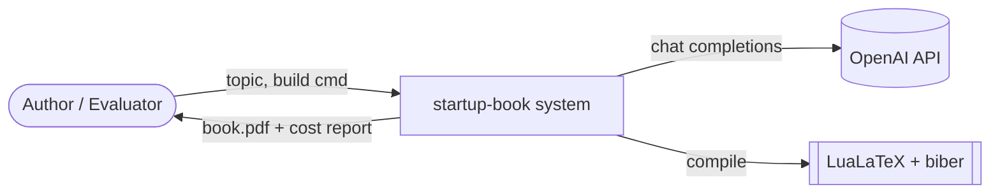
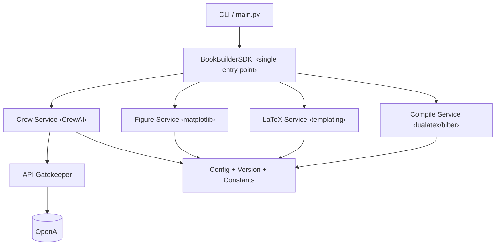
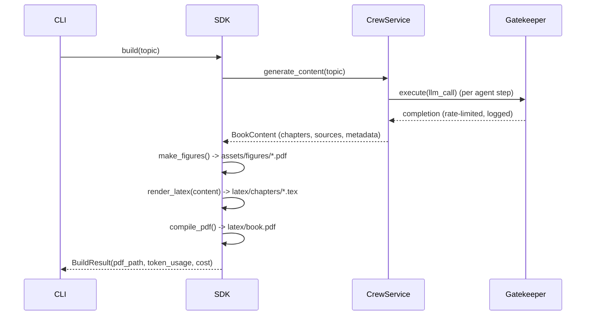

# PLAN — Architecture & Technical Plan

**Product:** `startup-book` · **Version:** 1.00 · **Status:** Draft
Companion to [`PRD.md`](PRD.md). Defines how the system is structured and why.

---

## 1. C4 Model

### 1.1 Context (Level 1)


### 1.2 Container (Level 2)


### 1.3 Component (Level 3) — package layout
```
src/startup_book/
├── __init__.py            # exports public API + __version__
├── main.py                # CLI entry (thin; delegates to SDK)
├── constants.py           # immutable project constants
├── sdk/
│   ├── __init__.py
│   └── sdk.py             # BookBuilderSDK — the ONLY business entry point
├── services/
│   ├── crew_service.py    # build + run the CrewAI crew
│   ├── latex_service.py   # content -> .tex (template fill)
│   ├── compile_service.py # multi-pass LuaLaTeX + biber build
│   └── figure_service.py  # matplotlib figures -> vector PDF
├── agents/
│   ├── definitions.py     # Agent factory (role/goal/backstory/tools)
│   └── tasks.py           # Task factory (description/expected_output/context)
└── shared/
    ├── gatekeeper.py      # ApiGatekeeper — all external calls funnel here
    ├── config.py          # ConfigManager — reads config/*.json + .env
    └── version.py         # __version__ = "1.00" + compatibility check
```

> **150-LOC rule:** any file approaching the limit is split (e.g. agent
> definitions vs task definitions live in separate files; the crew service only
> wires them together).

---

## 2. SDK-Centric Architecture (guidelines §4)

```
External consumers (CLI / future GUI / REST / tests)
        │
        ▼
   ┌──────────────┐
   │ BookBuilderSDK│  ← single entry point for ALL business logic
   └──────┬───────┘
          ▼
   ┌──────────────┐
   │   Services   │  ← crew, latex, compile, figure (orchestrators)
   └──────┬───────┘
          ▼
   ┌──────────────────┐
   │ Infrastructure   │  ← Gatekeeper→OpenAI, file I/O, lualatex subprocess
   └──────────────────┘
```

- **No business logic in `main.py`** — it parses args and calls the SDK.
- The SDK exposes: `generate_content(topic)`, `make_figures()`,
  `render_latex(content)`, `compile_pdf()`, and `build(topic)` (full pipeline).

---

## 3. Data Flow & Contracts



**Key contracts (pydantic models in `services`/`shared`):**
- `BookContent`: `title`, `chapters: list[Chapter]`, `sources: list[Source]`,
  `token_usage`.
- `Chapter`: `heading`, `body_markdown`, `language` (`he`/`mixed`).
- `BuildResult`: `pdf_path`, `pages`, `token_usage`, `estimated_cost_usd`.
- `RateLimitConfig`: `requests_per_minute`, `concurrent_max`,
  `retry_after_seconds`, `max_retries` (from `config/rate_limits.json`).

---

## 4. Architecture Decision Records (ADRs)

**ADR-1 — CrewAI for orchestration.**
*Context:* role-based writing team with clear, bounded tasks.
*Decision:* CrewAI sequential process (Researcher→Writer→Reviewer→LaTeX).
*Trade-off:* less stateful control than LangGraph, but the workflow is linear and
predictable → CrewAI is the better fit (architecture deck: "role-based agent
teams, clear tasks, bounded autonomy"). *Alternatives:* LangGraph (overkill for
a linear pipeline), AutoGen (conversational, harder to reproduce).

**ADR-2 — OpenAI provider behind a Gatekeeper.**
*Decision:* funnel every LLM call through `ApiGatekeeper` with config-driven rate
limits, retries and logging. *Trade-off:* a thin indirection layer for a large
gain in observability, cost control and testability (mockable seam).
*Alternative:* call the SDK directly (rejected — violates §5).

**ADR-3 — LuaLaTeX + polyglossia for Hebrew BiDi.**
*Decision:* LuaLaTeX with `polyglossia` (Hebrew main, English secondary) and a
Hebrew-capable OpenType font. *Trade-off:* heavier than pdfLaTeX but the only
clean path to correct RTL/LTR + Hebrew shaping; matches assignment §13.2.
*Alternative:* XeLaTeX (allowed fallback, same source).

**ADR-4 — Deterministic, grounded content by default.**
*Decision:* ship curated source facts and keep live web-search tools optional
(off by default). *Trade-off:* less "live" research, but reproducible, cheap and
build-stable runs (KPI K3/K7). Web search can be enabled via config.

**ADR-5 — `uv` + pinned Python 3.12.**
*Decision:* manage env and deps with `uv`, pin Python 3.12 (CrewAI lags 3.14).
*Trade-off:* an extra interpreter download; gains reproducibility (guidelines §8).

**ADR-6 — LaTeX as committed source + generated chapters.**
*Decision:* hand-author a robust template/preamble; the crew fills chapter
bodies. *Trade-off:* the LLM doesn't emit the whole document (risky for BiDi
correctness); we keep structural LaTeX human-controlled and inject prose.

---

## 5. Versioning Plan (guidelines §8.1)

| Item | Location | Initial |
|------|----------|---------|
| Code version | `src/startup_book/shared/version.py` (`__version__`) | 1.00 |
| Config version | `config/setup.json` → `"version"` | 1.00 |
| Rate-limit config version | `config/rate_limits.json` → `"version"` | 1.00 |

On startup the SDK validates that config versions are compatible with the code
version (logs a warning on mismatch). Git **tags** mark releases (`v1.0.0`).

---

## 6. Testing & CI Strategy
- `tests/unit/` mirrors `src/` (one test module per source module).
- `tests/integration/` exercises `build()` with a **mocked** crew/LLM and a real
  (fast) LaTeX compile in CI-capable environments.
- `conftest.py` holds shared fixtures (fake config, fake completions).
- Coverage gate `fail_under = 85`; ruff gate 0 violations.

## 7. Git Workflow
- Frequent, small commits with conventional messages.
- Short-lived feature branches for larger units, merged with `--no-ff` to keep
  history; tag the final release. (Professor counts commits → favour granularity.)
